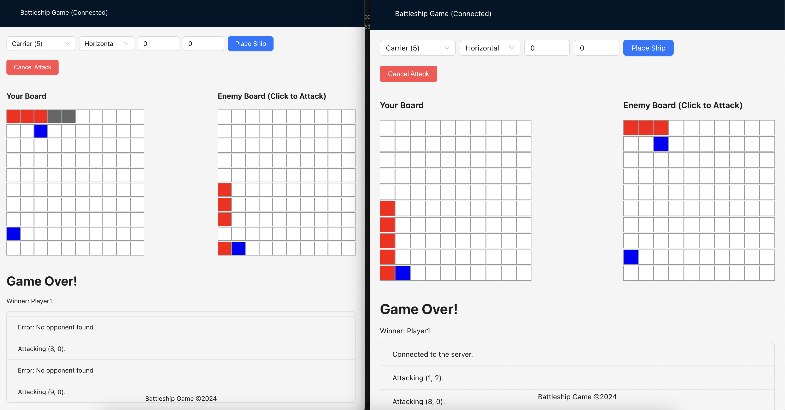

# Battleship Game

A classic two-player naval strategy game where players try to sink each other's fleet of ships. Players take turns guessing coordinates to attack their opponent's hidden ships on a grid-based board.

## Game Preview



## Features

- Traditional 10x10 grid gameplay
- 5 different types of ships to deploy

## How to Play

1. Place your ships on the board
2. Take turns firing at coordinates to find enemy ships
3. First player to sink all enemy ships wins!

## Running the Game

### Server

```
go run main.go
```

### Client

```
npm start
```
